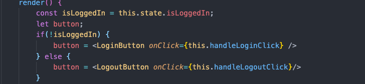
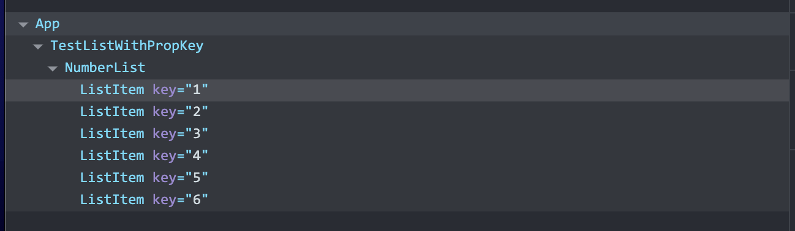

### React的特点：

1. 声明式
2. 组件化
3. 一次学习，跨平台编写的 （React Native & Node SSR）


### 1. JSX

为什么要使用JSX?

1. 关注点分离
2. JSX是JS的扩展

**基本语法**:

- JSX语法中`{}` 大括号内可以放置`JS的表达式`

```jsx
const name = 'Bob Evan'
const element = <h1>Hello ,{name}!</h1>
function TestJSX() {
  return element;
}
export TestJSX;
```

- JSX也是一个`JS表达式` ， JSX会被编译为JavaScript的函数调用，并且对其取值后得到JavaScript对象。  也即是说JSX在JS中就像一个变量可以计算（if, while ,for， return 等）。

```js
function formatName(user) {
    return user.firtName + ' ' + user.lastName;
}
function getGreeting(user) {
    if(user) {
        return <h1>Hello, {formatName(user)}!</h1>
    } else {
        return <h1>Hello, Stranger!</h1>
    }
}
const user = undefined;

function TestJSX03() {
    return getGreeting(user)
}

export default TestJSX03;
```

- JSX中指定属性： `{}` 或者 引号 

```js
const avatar = {
  url: "http://test.com/img/user.png" 
}
// 两种写法是等效的，第二种适合动态的改变
const userImage = 
const userImage = 
```


- JSX中可以进行`组合`: 可以是一个单独的JSX元素也可以几个嵌套组合
- JSX防止注入攻击 ： 可以安全的使用JSX插入用户输入的内容 渲染之前需要进行转义成字符串， 有效防止XSS(cross-site-scripting)

- JSX的转义

```jsx
const element = <h1 className="greeting"> Hello world! </h1> 
// 经过转义之后的内容为
React.createElement(
  type:'h1',
  props: {
  className: 'greeting',
  chidren:'Hello world!'
  }
)
```

### 2. 元素的渲染

```js
// ReactDOM负责更新DOM与React元素保持一致。
ReactDOM.render()
```

更新已有的元素： react元素是不可变对象，保留着某个特定时刻的UI 。只更变化的内容。


### 3. 组件&Props

> 建议组件的开头字母大写，避免React将小写的组件视为原生DOM标签。

组件，从概念上类似于JavaScript函数，接受任意的`入参（即props) `并返回`描述展示内容的React元素`。


组件中可以使用其他的自定义组件。

```js
function App() {
  return (
    <div >
        {/* <TestJSX />
        <TestJSX02 />
        <TestJSX03 /> */}
        {/* <TestRender /> */}
        <TestComponent name="Bob"/>
        <TestClassComponent name="Evan" />
    </div>
  );
}
export default App;
```

关于props， 所有的组件必须像纯函数一样保护它们的props不被修改。


### 4. state & 声明周期

- state是完全私有的，受控于当前的组件 `setState`
  1. 不要直接修改state
  2. state的更新可能是异步的
  3. state的更新可能会被合并
- React中的生命周期
  1. 创建
  2. 挂载
  3. 销毁
- 数据是单向流动的


### 5. 事件处理

- 合成事件

### 6. 条件渲染



**很明显在这个列子中 ， JSX元素直接参与JS的运算。**
1. if..else..
2. && 逻辑运算符
3. 三元运算符

组件的render方法中返回Null并不会影响组件的生命周期。

### 7. 列表和key
- 常用map来根据数组内元素构造相应的UI

- `a key should be provided for list items,` 当你创建一个元素时，必须包含一个key属性。key帮助react识别哪些元素改变了。`一个key最好是在列表中用于独一无二的字符串`。通常是数据的id来作为元素的key**如果不指定显示的key，那么react会默认的使用索引作为列表的key值**。

- key的正确使用方式：在最近的组件上, 如下所示。

```jsx
// 创建了一个ListItem组件
function ListItem({num}){
    return <li>{num}</li>
}

// 创建NumberList组件,
// 并在组件内调用ListItem，作为列表项，因此，要在ListItem上设置key
function NumberList({numbers}) {
    const ListItems = numbers.map(
      num => <ListItem key={num.toString()} num={num}/>
    ) 
    return(
        <ul>
            {ListItems}
        </ul>
    )
}

function TestListWithPropKey() {
    return <NumberList numbers={[1,2,3,4,5,6]}/>
}

export default TestListWithPropKey;
```




- map的嵌套层次太多，可以提出一个组件

### 8.表单
- 受控组件： 表单元素 input, textarea select等通常自己维护state, 并根据用户的输入进行更新。 而React中，可变状态通常保存在组件的state属性中，并且只能够通过setState来更新。将两者结合起来，使React的state成为'唯一的数据源'。渲染表单的React组件还控制着用户的输入过中表单发生的操作。被React以这种方式控制取值的表单输入元素就叫做”受控组件“
- (核心： 表单元素  | React的state是唯一的数据源) **结合代码仔细体会受控组件这句话**

```jsx

import React from 'react'
class NameForm extends React.Component {
    constructor(props) {
        super(props)
        this.state = {value:''}
        this.handleSubmit = this.handleSubmit.bind(this)
        this.hanldeChange = this.handleSubmit.bind(this)
    }
    hanldeChange(e) {
        this.setState({vale:e.target.value})
    }
    handleSubmit(e) {
        alert('提交的名字为：' + this.state.value)
        e.preventDefault();
    }
    render() {
        return (
            <form onSubmit={this.handleSubmit}>
                <label>
                    <input type="text" value={this.state.value} onChange={this.hanldeChange}/>
                </label>
                <input type="submit" value="提交" />
            </form>
        )
    }
}
```

